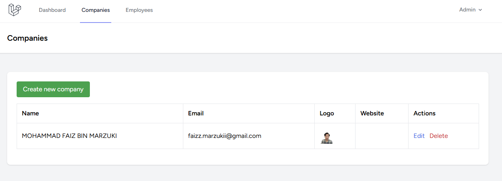
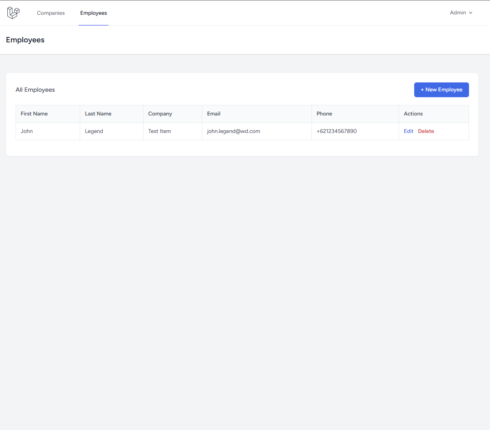

# FNXPERTS Mini-CRM

A Laravel-based admin panel to manage companies and their employees, built as part of the FNXPERTS SDN. BHD. Web Developer Assessment.

---

## Tech Stack

- **Framework**: Laravel 13.x
- **Language**: PHP 8.5
- **Database**: SQLite
- **Authentication**: Laravel Breeze (Blade stack)
- **Frontend**: Blade + Tailwind CSS

---

## Features

- Admin login (registration disabled)
- **Companies** — Create, Read, Update, Delete
  - Fields: Name, Email, Logo (min 100×100px), Website
  - Company logo stored in public storage
- **Employees** — Create, Read, Update, Delete
  - Fields: First Name, Last Name, Company, Email, Phone
  - Linked to a company via foreign key
- Pagination (10 items per page) on both lists
- Form validation using Laravel Request classes
- REST API endpoint returning a company with its employees and employee count

---

## Setup

```bash
# Clone the repo
git clone https://github.com/faizzmarzuki/assessment-fnxperts.git
cd assessment-fnxperts

# Install dependencies
composer install
npm install && npm run build

# Environment setup
cp .env.example .env
php artisan key:generate

# Database
touch database/database.sqlite
php artisan migrate --seed

# Storage
php artisan storage:link

# Run
php artisan serve
```

---

## Login Credentials

| Field    | Value           |
|----------|-----------------|
| Email    | admin@admin.com |
| Password | password        |

---

## API

### Get company with employees

```
GET /api/companies/{id}
```

**Example request:**
```
GET http://localhost:8000/api/companies/1
```

**Example response:**
```json
{
  "id": 1,
  "name": "Acme Corp",
  "email": "info@acme.com",
  "logo": null,
  "website": "https://acme.com",
  "employee_count": 3,
  "employees": [
    {
      "id": 1,
      "first_name": "John",
      "last_name": "Doe",
      "company_id": 1,
      "email": "john@acme.com",
      "phone": "012-345-6789"
    }
  ]
}
```

---

## Screenshots

### Companies List


### Employees List


### API Response (Postman)


---

## Project Structure

```
app/
├── Http/
│   ├── Controllers/
│   │   ├── CompanyController.php
│   │   ├── EmployeeController.php
│   │   └── Api/CompanyController.php
│   └── Requests/
│       ├── StoreCompanyRequest.php
│       ├── UpdateCompanyRequest.php
│       ├── StoreEmployeeRequest.php
│       └── UpdateEmployeeRequest.php
├── Models/
│   ├── Company.php
│   └── Employee.php
routes/
├── web.php
├── api.php
└── auth.php
resources/views/
├── companies/
│   ├── index.blade.php
│   ├── create.blade.php
│   └── edit.blade.php
└── employees/
    ├── index.blade.php
    ├── create.blade.php
    └── edit.blade.php
```
